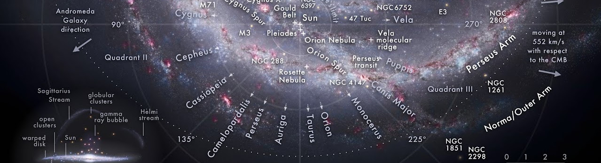
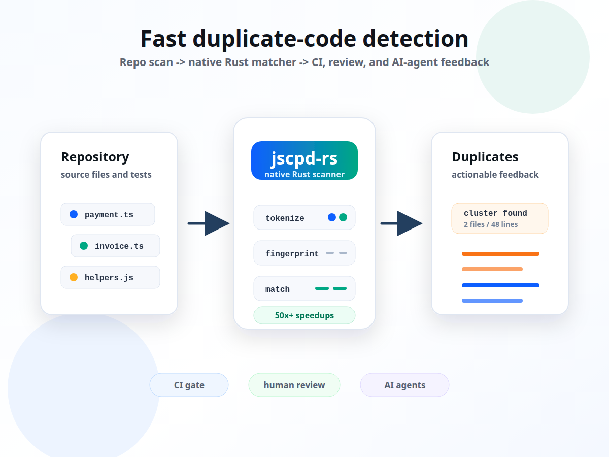

```{=html}
<style>
body {
  padding-top: 0 !important;
}

#quarto-header {
  display: none;
}

#quarto-content {
  display: block !important;
  width: 100% !important;
  max-width: none !important;
  margin: 0 !important;
  padding-top: 0 !important;
}

#quarto-content.page-navbar {
  margin-top: 0 !important;
}

#title-block-header {
  display: none !important;
  margin: 0;
  padding: 0;
}

#quarto-document-content > *:first-child {
  margin-top: 0 !important;
}

main.content {
  width: 100% !important;
  max-width: none !important;
  margin: 0 !important;
  padding: 0 !important;
  grid-column: auto !important;
}
</style>

<header class="home-hero">
  
  <div class="home-profile">
    
    <div class="home-profile-copy">
      <p class="home-eyebrow">Architect / Full-stack engineer / Tool builder</p>
      <h1>Viacheslav Bogdanov</h1>
      <p>
        I research hard problems, turn ideas into working products, and build
        high-quality tools that make other builders faster.
      </p>
      <div class="home-links">
        <a href="posts.html">Writing</a>
        <a href="projects.html">Projects</a>
        <a href="about.html">About</a>
      </div>
      <div class="social-links home-social-links" aria-label="Social links">
        <a href="https://www.linkedin.com/in/viacheslav-v-bogdanov/">
          <i class="bi bi-linkedin" aria-hidden="true"></i>
          <span>LinkedIn</span>
        </a>
        <a href="https://x.com/vvbogdanov">
          <i class="bi bi-twitter-x" aria-hidden="true"></i>
          <span>X @vvbogdanov</span>
        </a>
        <a href="https://medium.com/@vvbogdanov">
          <i class="bi bi-medium" aria-hidden="true"></i>
          <span>Medium</span>
        </a>
        <a href="https://github.com/vv-bogdanov">
          <i class="bi bi-github" aria-hidden="true"></i>
          <span>GitHub</span>
        </a>
      </div>
    </div>
  </div>
</header>
```

::: {.home-content}

My work spans developer tooling, AI-assisted engineering, DeFi systems, mobile
products, automation, and reliable end-to-end product delivery.

This blog is a minimal public notebook for technical write-ups: architecture,
benchmarks, implementation decisions, product-quality trade-offs, and the
philosophy behind tools that should be fast, reliable, and simple to operate.

## Themes

```{=html}
<div class="theme-grid">
  <div>
    <h3>Developer tools</h3>
    <p>Fast tools for large repositories, CI/CD, code quality, and reliable release loops.</p>
  </div>
  <div>
    <h3>AI-assisted engineering</h3>
    <p>Agent workflows that still rely on deterministic checks, clear feedback, and human judgment.</p>
  </div>
  <div>
    <h3>Architecture</h3>
    <p>Systems that stay understandable under production pressure and remain cheap to change.</p>
  </div>
  <div>
    <h3>Product research</h3>
    <p>Prototype, measure, simplify, ship, and improve from real usage.</p>
  </div>
</div>
```

## Recent Writing

```{=html}
<article class="featured-post">
  <a class="featured-image" href="posts/fast-duplicate-code-detection-for-agents/">
    
  </a>
  <div class="featured-copy">
    <p class="featured-meta">Jun 4, 2026 / developer tools / Rust / CI / npm</p>
    <h3>
      <a href="posts/fast-duplicate-code-detection-for-agents/">
        AI agents generate code faster. Duplicate-code checks need to keep up.
      </a>
    </h3>
    <p>
      A launch note for <code>jscpd-rs</code>: a fast native duplicate-code
      detector for humans, AI coding agents, and CI/CD pipelines.
    </p>
  </div>
</article>
```

:::
